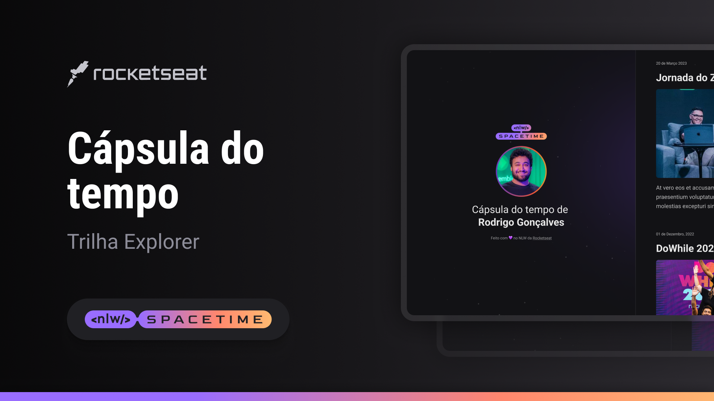

  

## 💻 Projeto
Esee é um projeto Web Responsivo de uma cápsula do tempo para exibir memórias em uma linha do tempo.

## 🚀 Tecnologias
Esse projeto foi desenvolvido durante o NLW da Rocketseat com as seguintes tecnologias:

- HTML
- CSS
- Git e Github

## 🏷️ Layout
Você pode visualizar o layout do projeto através
[desse link](https://www.figma.com/file/7Xk1fNG95jXumlCnsvrdhZ/C%C3%A1psula-do-tempo-%E2%80%A2-Trilha-Explorer-(Community)-(Copy)?type=design&node-id=306%3A84&t=Ctv4rFBISXOA4aBj-1)
É necessário ter uma conta no [Figma](https://www.figma.com)